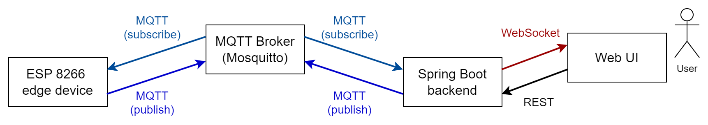
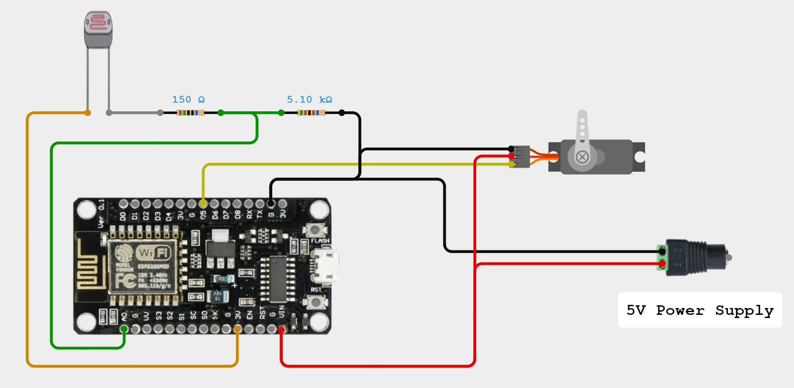

# IoT Smart Blinds

Smart Blinds is an IoT proof-of-concept (PoC) project that enables manual and automatic
control of window blinds via a web interface. The system demonstrates end-to-end
communication between an embedded edge device and a Spring Boot backend using MQTT,
with real-time UI updates via WebSockets.

## Overview

(to be added)

## Architecture Overview

#### The system has 4 main parts:
- ESP8266 edge device (controls the blinds, glare protection logic - AUTO mode)
- Mosquitto (MQTT Broker)
- Spring Boot backend (Web application logic)
- Web UI (User interface in the browser - WebSockets for live data)

#### Communication protocols:
-	MQTT (edge device (ESP8266) ↔ MQTT Broker ↔ Spring Boot backend)
-	REST (UI → Spring Boot backend)
-	WebSocket (Spring Boot backend → UI)

(All components communicate over a local Wi-Fi network using TCP/IP.)

<br/>
<div align="center">
  
  <div>System architecture diagram</div>
</div>
<br/>


The architecture is scalable. It is possible to add more devices without big changes. The devices and UI are not tightly coupled because they communicate through a MQTT broker making the design more robust. Live updating of the UI thanks to websockers ensures good UX and professional design.

## Screenshots 

### Web Application - UI
<div align="center">
  
  <div>The main dashboard that the user interacts with. It shows Telemetry data and device controls.</div>
</div>
<br/>
<br/>

<div align="center">
  
  <div>The UI was designed with responsiveness in mind for good UX on mobile platforms as well.</div>
</div>
<br/>

### Edge Device Smart blinds control (PoC)
<div align="center">
  
  <div>Edge device ESP8266 with light sensor and servo.</div>
</div>
<br/>
As mentioned this is just a PoC at the moment and is not yet controlling real blinds. However the PoC works and in the future for controlling real blinds a stronger servo motor (or potentially a stepper motor) could be used.

## Wiring diagram
<div align="center">
  
  <div>Smart Blinds Edge Device - current wiring diagram.</div>
</div>

## Technologies

#### Backend
- Java 21
- Spring Boot
- Spring Integration MQTT
- WebSockets (STOMP)
- Jackson (JSON processing)

#### Edge Device
- ESP8266
- Arduino framework
- Servo motor
- Light sensor

#### Communication
- MQTT (Mosquitto)

#### Infrastructure
- Docker (running Mosquitto and later can run also the Spring Boot app)

#### Frontend
- HTML / CSS / JavaScript
- Bootstrap
- Thymeleaf


## MQTT Topic Structure
The topic structure and the app is designed with multiple rooms and devices in mind.

```text
home/bedroom/blinds/{deviceId}/state
home/bedroom/blinds/{deviceId}/availability

home/bedroom/blinds/{deviceId}/cmd/mode
home/bedroom/blinds/{deviceId}/cmd/position
```

## Plans for the next version
- **Scheduled automation** - using Spring Boot Task Scheduler the backend will be able to automatically close the blinds according to user set schedule. This could run every day to close and open the blinds automatically or even based on the sunset and sunrise calculations
